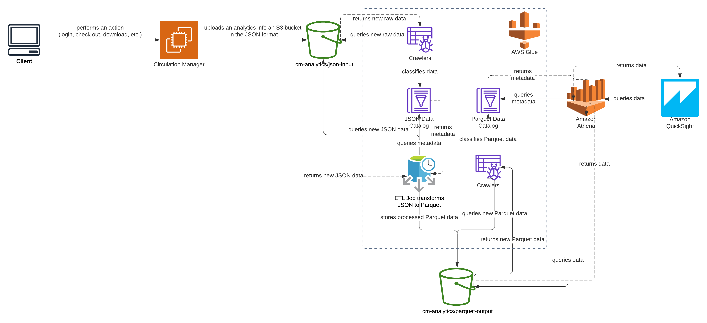

# SimplyE Analytics Testbed

Analytics testbed illustrates a different approach for storing and processing analytics events generated by Circulation Manager, the SimplyE suite's back-end component.

The testbed shows how analytics events can be stored in a JSON format in AWS S3 data lake instead of storing them in the relational format in AWS RDS.
Using an S3 data lake approach gives us much more flexibility. AWS Glue allows to process raw data and transform it in a format that can be effectively queried by AWS Athena.

The overall architecture of the Analytics Testbed is shown in the picture below:


It contains the following components:

- S3 bucket residing the following folders:
  - **athena** used for storing Athena query results.
  - **glue** used for storing Glue scripts and temporary results.
  - **json-input** used for storing ingested by Circulation Manager analytics events in the JSON format.
  - **parquet-output** used for storing events from **json-input** transformed to Apache Parquet format by a Glue job.
- Glue data catalogs and crawlers:
  - Crawler used to parse **json-input** folder and create a data catalog with a data schema describing the structure of Circulation Manager's analytics events (fields, their types, etc.).
  - Job designed to transform JSON data into Apache Parquet format to optimize Athena queries cost and performance.
  - Crawler designed to parse **parquet-output**, the folder where analytics events in Apache Parquet format reside in.
- Athena used to query data residing in **parquet-output** S3 folder and using Glue data catalog metadata.
- QuickSight used to create visualizations and dashboards.

## Create the testbed manually

Please find the steps required to create the testbed manually in [MANUAL.md](docs/MANUAL.md).

## Create the testbed via Terraform

```
cd terraform
terraform init
terraform plan
terraform apply
```

## Test the testbed
