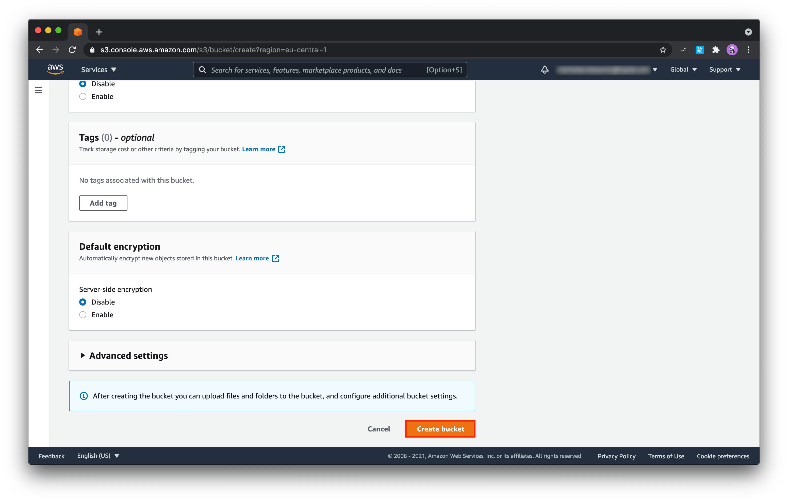
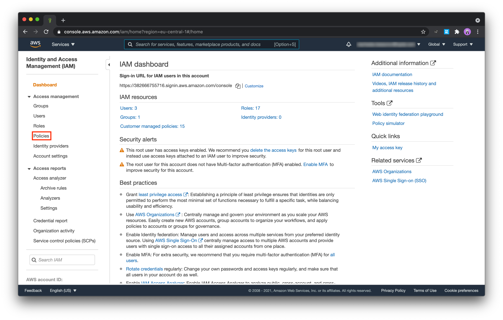
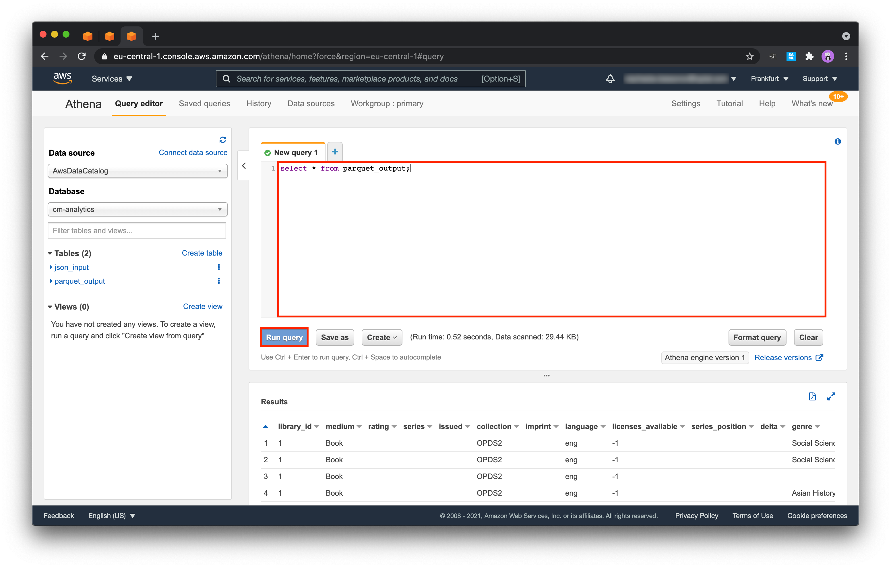

# Create SimplyE Analytics Testbed Manually

These are the steps required to create a testbed manually:

## Creating an S3 bucket
### Creating a bucket
1. Sign in to the AWS Management Console, open the Amazon S3 console at https://console.aws.amazon.com/s3/ and click on **Create bucket** button:
  

2. In the newly opened dialog enter a new bucket name:
  

> :information_source: To be able to make the name unique you may want to add a [GUID](https://www.guidgenerator.com/online-guid-generator.aspx) to its end.

3. Scroll to the end of the page and click on **Create bucket**:
  

4. After the bucket is created, you'll be redirected to the list of all available buckets.
Find the newly created bucket in the list and click on its name:
  

### Creating required folders
5. In the new window showing bucket's settings click on **Create folder** button:
  

6. In the folder's setting window enter the name: **json-input**. It's the folder that will be storing JSON files containing Circulation Manager analytics events:
  

Repeat steps 5 - 6 and create the following folder structure:
```
|- athena
|- glue
   |- scripts
   |- temporary
|- json-input
|- parquet-output
 ```

7. After creating all the folders, the bucket's folder structure should look like as it's shown on the screenshot below:
  

### Uploading test data to the bucket
8. Now upload test files to the bucket. Go to **json-input** folder and click on **Upload** button:
  

9. Drag and drop the files from [test-data](../test-data) folder:
  

10. After adding all the files scroll down to the end of the page and click on **Upload** button:
  

## Creating a Glue crawler for json-input folder
### Creating a new crawler
11. Open the AWS Glue console at https://console.aws.amazon.com/glue/, choose **Crawlers** in the navigation pane and then click **Add crawler**:
  

12. Enter the name of the new crawler and click on **Next**:
  

13. Select **Crawl new folders** and click on **Next**:
  

14. Select **S3** data store and choose **json-input** folder as **Input path**:
  

15. Let Glue to generate a new IAM role, specify its name and click on **Next**:
  

16. Choose **Run on demand** as **Frequency** and click on **Next**:
  

17. Click on **Add database**:
  

18. Enter the name of the database and click on **Create**:
  

19. Check **Update all new and existing partitions with metadata from the table**:
  

20. Click on **Next** until the last page of the wizard and then click on **Finish**.

### Running the crawler
21. Select the newly created crawler in the list and click on **Run** to trigger it. After running you should be able to see the message saying that it completed and a new table has been successfully created:
  

### Updating the schema created by the crawler
22. Select **Tables** on the left, choose **json_input** and click on **Edit schema**:
  

23. Select **Tables** on the left, choose **json_input** and click on **Edit schema**:
  

24. Walk through all the columns and change data type to `timestamp` for the following columns:
* **issued**
* **end**
* **availability_time**
* **start**
* **published**
  
After finishing scroll down to the end of the page and click on **Save**.

## Creating a Glue job for converting json-input data to the Apache Parquet format
### Creating an IAM policy for the Parquet converter
25. Open the IAM console at https://console.aws.amazon.com/iam/, in the navigation pane on the left choose **Policies**:
  

26. Click on **Create policy**:
  

27. Switch to **JSON** tab and insert the following:
```
{
    "Version": "2012-10-17",
    "Statement": [
        {
            "Effect": "Allow",
            "Action": [
                "s3:GetObject"
            ],
            "Resource": [
                "arn:aws:s3:::<cm-analytics-bucket>/json-input*"
            ]
        },
        {
            "Effect": "Allow",
            "Action": [
                "s3:GetObject",
                "s3:PutObject",
                "s3:DeleteObject"
            ],
            "Resource": [
                "arn:aws:s3:::<cm-analytics-bucket>/glue*",
                "arn:aws:s3:::<cm-analytics-bucket>/parquet-output*"
            ]
        }
    ]
}
```
where `<cm-analytics-bucket>` must be replaced with the name of the bucket created in 1 - 3.
  

28. Enter the new policy's name on the review page and click on **Finish**:
  

### Creating an IAM role for the Parquet converter
29. In the navigation pane on the left choose **Roles** and click on **Create role**:
  

30. Choose Glue as a trusted entity and go to the next page:
  

31. Choose the following policies:
* **AWSGlueServiceRole**
* **AWSGlueServiceRole-CMAnalyticsParquetConverter**, the policy created in 21 - 24:
  

32. Enter the new role's name and click on **Create role**:
  

### Creating a Glue job
33. Open the AWS Glue console at https://console.aws.amazon.com/glue/, choose Crawlers in the navigation pane and then click **Add job**:
  

34. Enter the name of the new job, select the role created in 29 - 32:
  

35. Then scroll down to **Advanced properties**, enable **Job bookmark** and scroll down to the next page of the wizard.

36. Choose **json-input** as a data source and click on **Next**:
  

37. Leave the tranform type as is and click on **Next**:
  

38. Choose Parqeut and **parquet-output** as a target type and target path respectively:
  

## Creating a Glue crawler for parquet-output
### Creating a new Glue crawler
39. In the navigation bar on the left select **Crawlers** again and click on **Add crawler**:
  

40. Enter the name and click on **Next**:
  

41. Specify source type and click on **Next**:
  

42. Specify **parquet-output** as a target data source:
  

43. Specify **parquet-output** as a target data source:
  

44. Let Glue create a new IAM role:
  

45. Select **cm-analytics** as a database where the crawler will reside the output table:
  

46. Run the newly created crawler:
  

## Set up AWS Athena
47. Open the Athena console at https://console.aws.amazon.com/athena/ and start setting it up:
  

48. Set **athena** folder as query result location and click on **Save**:
  

49. Run the query to ensure that Athena has been set up correctly:
  

## Setting up QuickSight
50. Create a new analysis in QuickSight:
  

51. Create a new dataset:
  

52. Set up a new Athena dataset and select **cm-analytics** database:
  

53. Select **parquet-output** table:
  

54. Don't use SPICE, directly query data:
  

55. Change to **N. Virginia** regioon and click on **Manage QuickSight**:
  

56. Click on **Security & permissions**:
  

57. Under **QuickSight access to AWS services** click on **Add or remove**:
  

58. Scroll down to **Amazon S3** and click on **Select buckets**:
  

59. Select the bucket created in **Creating an S3 bucket** and click on **Finish**:
  

60. Click on **Update**:
  

61. Try to create a new dashboard:
  